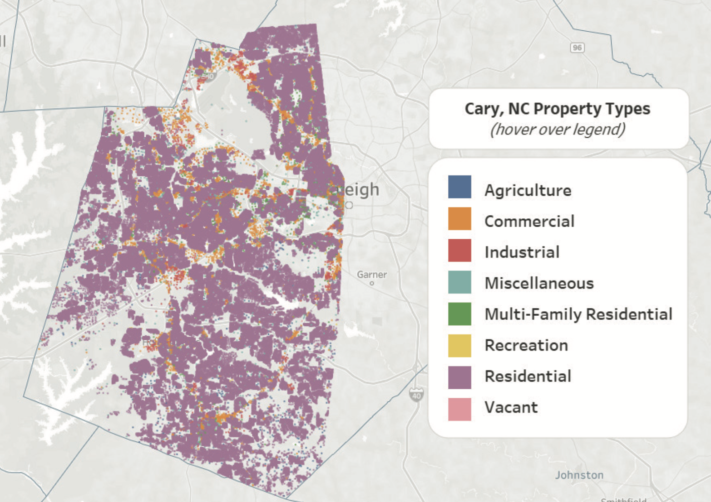

## About

Hi, I'm Kirsten. I'm a data analyst with a background in apparel material development, having worked for industry leaders like Adidas and Nordstrom. During my career, I saw firsthand how **critical data is in making smart business decisions**—whether it’s optimizing supply chains, segmenting customers, or validating products. That realization inspired me to pivot into data analytics, combining my industry expertise with technical skills to help businesses uncover insights and drive innovation.

**I’ve always been fascinated by the stories data can tell**. Whether it’s tracking my own spending habits (I’ve logged every expense for the past five years!) or analyzing my health data—like calories, macros, and micronutrients—I love finding hidden patterns and using them to make sound decisions. That same curiosity drives me professionally as I dig into data to **reveal trends, solve problems, and create actionable strategies**.

If you're curious about how data can transform business strategy or want to see some of my work, check out some of my latest projects below. I’d love to connect and help uncover the hidden gems in your data!

 

## Education
- Certificate of Data Analytics | CareerFoundry (_2025_)								       		
- B.S., Apparel & Textile Design | University of Idaho

 

## Work Experience

### <a href="https://kirstencurrie.github.io/assets/img/Currie_Kirsten_Resume.pdf" target="_blank">Resume</a>

 

## Projects

### [Cary, NC Real Estate Analysis](project1.md)

What property features drive property values? Is it acreage? Proximity to schools? Property age? With exploratory data analysis and machine learning techniques such as linear regression and clustering, this study dives into publicly available data on Cary, North Carolina property type features and values. These initial learnings could be leveraged by Real Estate investors or first-time home buyers to build a better understanding of where to locate well-positioned properties in terms of future growth of the city as well as where potential investment gems might be found.

 

---

### [Instacart Basket Analysis](project2.md)

Customer segmentation is crucial in better understanding purchasing behaviors and how to anticipate customer demand. This study evaluates different ways of grouping Instacart customer profiles to uncover interesting trends and unlock different marketing or ad campaign potentials. For example, have you considered the buying habits of 3am customers? Meet Insomniac Shoppers. Read more about how aggregation techniques in Python can help unlock hidden customer segmentations.

