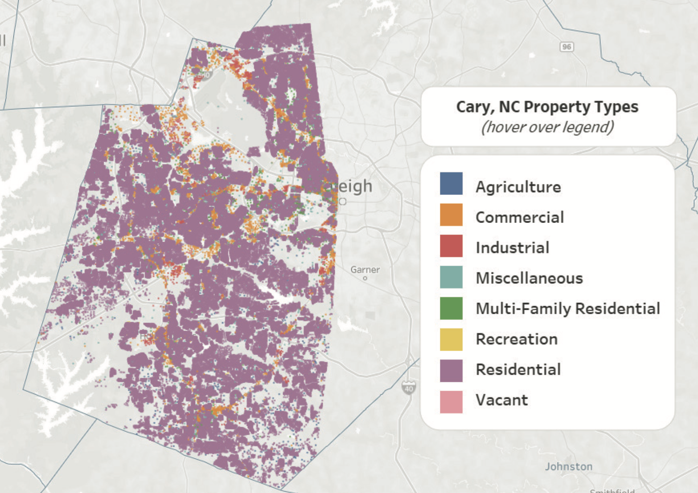

## About

Hi, I’m Kirsten. I’m a data analyst and AI automation enthusiast with a background in apparel product development, having worked with industry leaders like Adidas and Nordstrom. My career began at the intersection of creativity, technology, and business—developing products, analyzing performance, and collaborating across global teams. That experience showed me the power of data to drive smarter decisions and ultimately inspired my transition into analytics.

Today, I specialize in transforming complex business questions into actionable insights through data analysis, automation, and emerging AI technologies. I enjoy building self-service tools, streamlining workflows, and exploring how AI can accelerate problem-solving and make teams more effective. My background in product development gives me a unique perspective: I understand both the human side of business decisions and the technical tools needed to support them.

I’ve always been fascinated by the stories hidden within data. Whether it’s analyzing my personal spending patterns (I’ve tracked every expense for over six years!), exploring health and fitness data, or experimenting with generative AI models like Stable Diffusion, I’m constantly looking for ways technology can reveal patterns, create efficiencies, and inspire new ideas.

My current projects explore the intersection of analytics, automation, and artificial intelligence—from business intelligence dashboards and data analysis to AI-assisted workflows and creative AI applications.

If you’re interested in how data and AI can transform the way we work, feel free to explore my projects or connect with me. I’m always excited to learn, build, and uncover new possibilities with technology.

 

## Education
- Certificate of Data Analytics | CareerFoundry (_Spring 2025_)								       		
- B.S., Apparel & Textile Design | University of Idaho

 

## Work Experience

### <a href="https://kirstencurrie.github.io/assets/img/KirstenCurrie_DataAnalyst.pdf" target="_blank">Resume</a>

 

## Projects

### [Cary, NC Real Estate Analysis](project1.md)

What property features drive property values? Is it acreage? Proximity to schools? Property age? With exploratory data analysis and machine learning techniques such as linear regression and clustering, this study dives into publicly available data on Cary, North Carolina property type features and values. These initial learnings could be leveraged by Real Estate investors or first-time home buyers to build a better understanding of where to locate well-positioned properties in terms of future growth of the city as well as where potential investment gems might be found.

 

---

### [Instacart Basket Analysis](project2.md)

Customer segmentation is crucial in better understanding purchasing behaviors and how to anticipate customer demand. This study evaluates different ways of grouping Instacart customer profiles to uncover interesting trends and unlock different marketing or ad campaign potentials. For example, have you considered the buying habits of 3am customers? Meet Insomniac Shoppers. Read more about how aggregation techniques in Python can help unlock hidden customer segmentations.

 

---

### [Rockbuster Stealth Movie Rental Analysis](project3.md)

A movie rental business hopes to break out of the dark ages into the movie streaming business. Board members at a fictional company (Rockbuster Steath) hope a data analyst can sift through their data tables to decipher what the top performing, movie genres, and highest paying customers are. Once all of this insightful data is gleaned, what will their first foray into digitization be??

---

### [ClimateWins Weather Data Machine Learning Analysis](project4.md)

Have you ever wondered which metrics are most effective for predicting whether your city will experience fair or poor weather conditions? Should you focus on minimum temperatures, maximum temperatures, wind velocity, or the number of sunny days? By leveraging both supervised and unsupervised machine learning techniques, this project explores the most critical features to measure and identifies the models best suited to deliver accurate and efficient weather predictions. This study envisions how a fictional nonprofit organization could integrate machine learning strategies into their weather forecasting efforts, providing actionable insights for improved decision-making.

 

---

### [How to Train AI on your Drawing Style using Stable Diffusion](project5.md)

This article explores the process of fine-tuning an AI model using Stable Diffusion on a personal drawing style. The premise for this work was instigated by former experience in lingerie design and wanting to explore the overlap between signature design style and AI.

 
