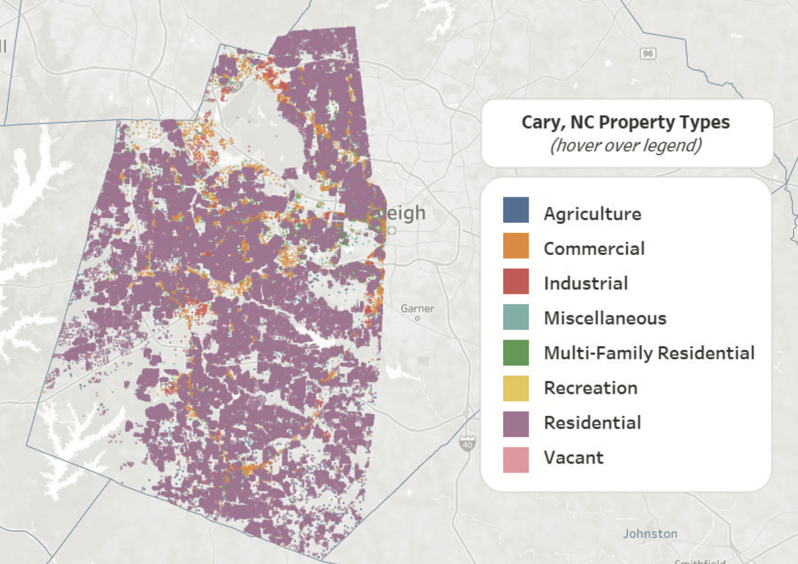

# Cary, NC Real Estate Analysis

### [Tableau Presentation Link](https://public.tableau.com/app/profile/kirsten.currie/viz/CaryNC_PropertyValueAnalysis/CaryProperties?publish=yes)

### [Github Repository](https://github.com/kirstencurrie/cf_cary-real-estate)

 

## Intro

The following analysis was an opportunity to leverage more complex data analysis skills such as linear regression and k-means cluster analysis through machine learning.

With personal interest in Raleigh and surrounding surburb real estate, I utilized publicly available Cary, North Carolina real estate property data made publicly available by the city.

In depth information such as property location, zip code, geo location, price from most recent sale, acreage on deed, building square footage, land
value, etc were provided.

The most useful information was land classification (residential under 10 acres, commercial gas station, recreational golf course, apartments, etc) which helped create larger property category groupings (residential, commercial, etc).

***FIG. A:***  *Interactive Tableau layer map that shows distribution of Cary, NC property types.*

 
 

## Exploratory Analysis

The initial exploratory phase showcased the importance of thoroughly understanding data outliers.

The Cary Real Estate dataset contains more than just residential properties--some of which skewed the initial distribution analyses.

By digging in a bit further, it revealed interesting facts, such as the building with the highest value being the airport or discovering the oldest recorded historical property.

***FIG. B:***  *Exploratory data analysis led to the discovery of “outlier” values such as the Raleigh-Durham Intl.
Airport (it had the highest building value).*

 

Proper review of outliers can reveal important information and indicates that grouping into property categories will help fine-tune the analysis and
eliminate the need to cut out relevent information.

***FIG. C:***  *Left image shows histogram of building values across the entire dataset; the unusual distribution
indicates outlier values. Image on the right is the same plot, however narrowing into the “2 Family Residential”
property type, revealing much more informative data information.*

 

## Hypothesis Development

From initial correlation matrix testing, the following hypothesis was developed:

*The larger a property's acreage or building square footage, the higher the property value.*

***FIG. D:***  *Acreage variable was not included in this particular correlation matrix, but land value and total
building square footage seemed to have stronger potential correlations with the most recent total sale value
as well as land or building value, which is why the initial hypothesis was made.*

 

## Linear Regression

After performing linear regression on the Residential property acreage versus estimated property value and looking at regression scores (R2 value of only 6%), the data indicated that the initial hypothesis was weak and showed property acreage did not have a direct correlated relationship with property value.

***FIG. E:***  *Number of acres (across Residential properties) versus the estimated property value (a variable derived from land and
building values provided in the dataset), only had about a 6% potential correlation in the linear regression model.*

 

## K-Nearest Neighbors Clustering

Since linear regression indicated no distinct direct, linear relationships between variables, a k-means cluster machine learning analysis was applied to the entire dataset (incuding all property class types) to see if there were any “hidden” relationships not initially detected. Exploration of the “property age” variable showed a possible multi-variate relationship between property age & price.

***FIG. F:***  *K-Means clustering performed on property features versus property value. Left image shows no clear clusters with the property acreage and estimated property value. Right image shows more distinct clusters by age of property compared to the most recent total property sale value.*

 

## Conclusion

Initial analysis of Cary, NC real estate indicated that property age could have a potential, non-linear relationship to the property’s value.

Within this particular dataset (after cleaning), showed the newest properties had a median age of 7 years and median most recent total sale value of $424,500. Oldest homes had a median value of 74 years and median most recent total sale value of $148,000. 

Further analysis could be used to discover what features might help a home retain its value (location, recent renovation, proximity to schools/work/commerce, etc).

Property age could be further investigated as well--particularly the time period between when most recent sales took place versus property value. Data limitation could be that older properties had a longer time period between being sold and current date of analysis compared to newer properties, resulting in a potential recency bias with the change of property values over time.

*FIG. G: Bar chart comparing property age groupings (dervied from k-means cluster analysis) against total sale value, building value, and land value. Data reveals older properties have potential to be valued less than newer properties.*
