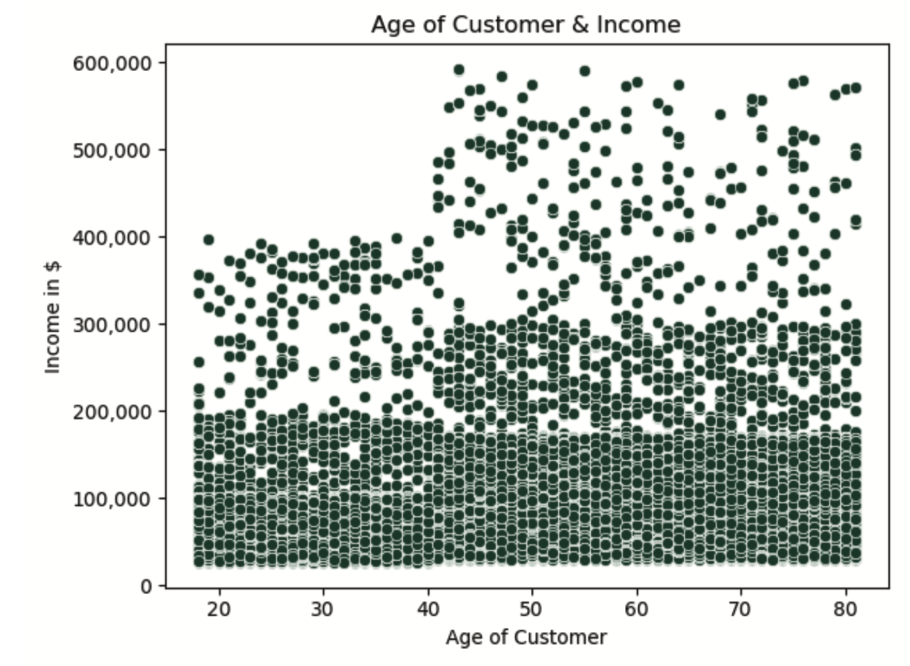
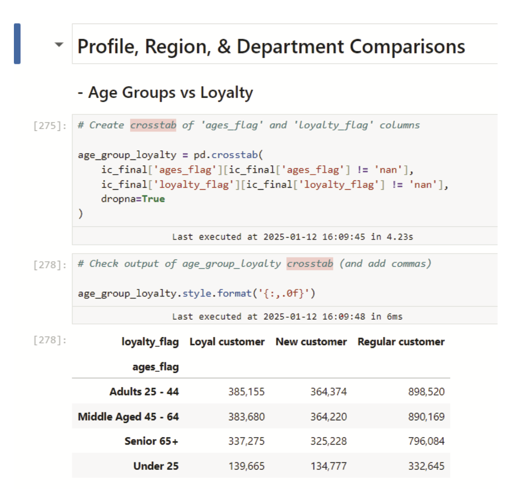
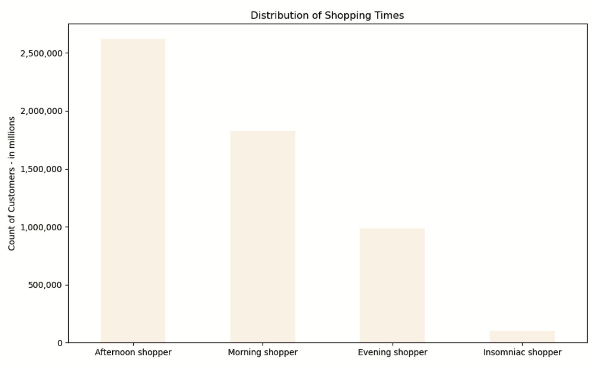
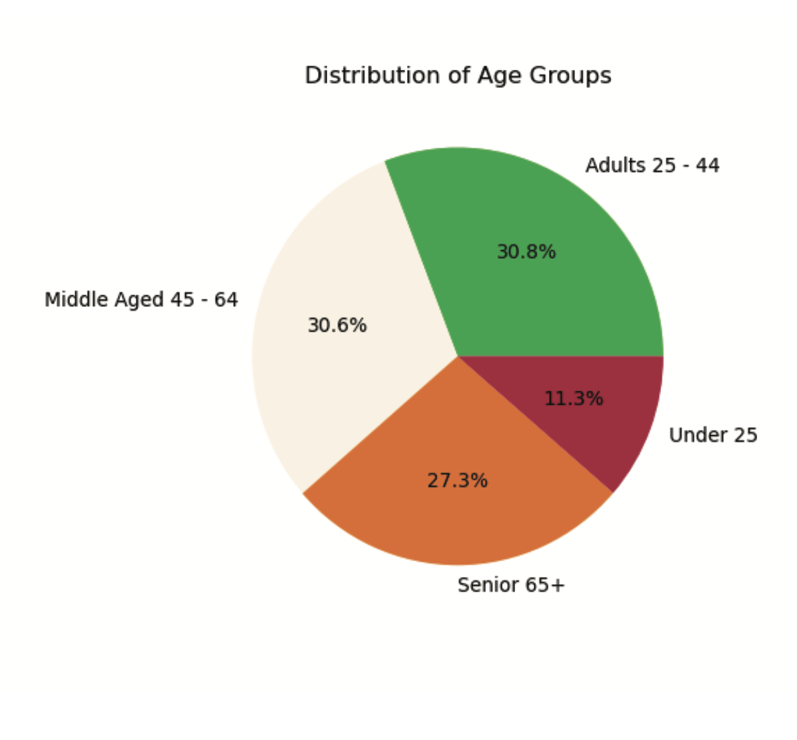
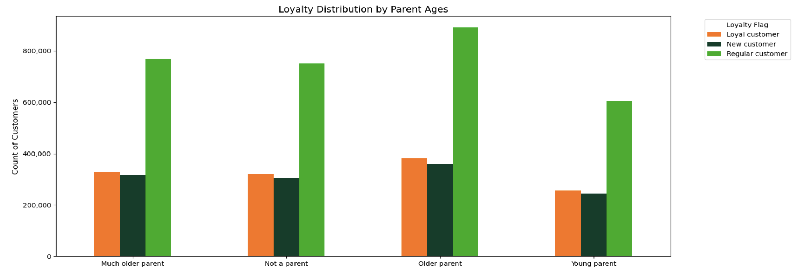
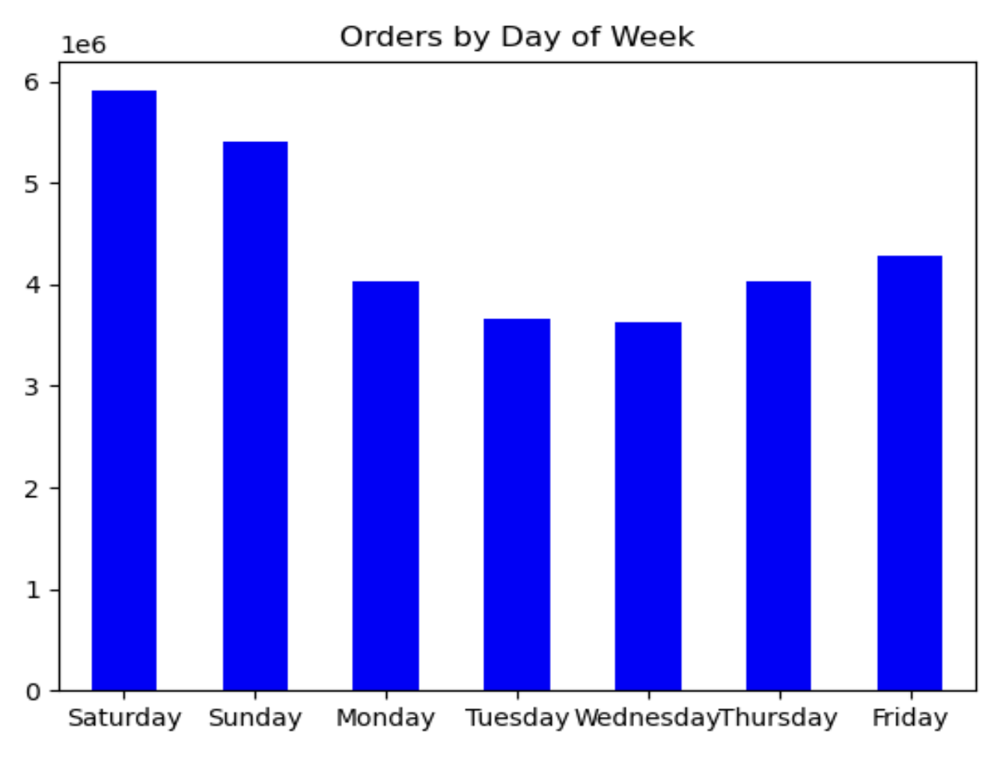
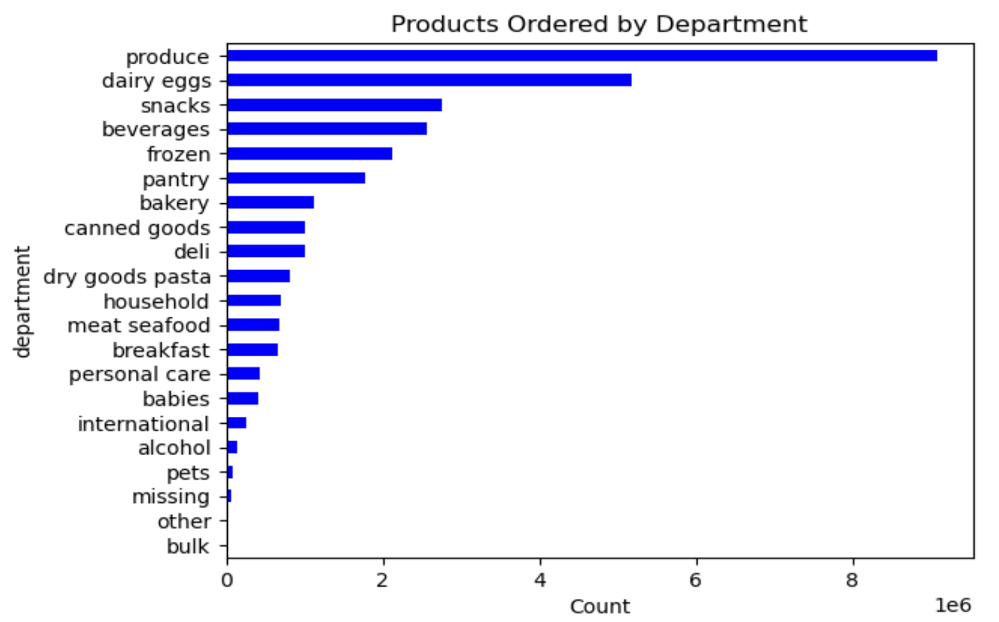
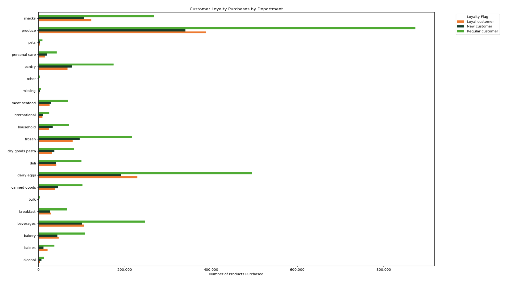

# Instacart Basket Analysis

### [Github Repository](https://github.com/kirstencurrie/cf_instacart)

### [View Live PowerBI Dashboard](https://app.powerbi.com/view?r=eyJrIjoiYWRlNDZiNmItMjBiMS00N2ZkLTlmZGEtNThlMGNjYjFiOTY4IiwidCI6ImM0ZWNkNjdhLWUxNDMtNDMyZS1hOTllLWZjNTYwZWM3MzQ2MCIsImMiOjF9)

 

## Intro

This was a theoretical Instacart project meant to analyze product sales via Products, Orders, and Customer datasets. 

Original data was accessed by Instacart and actual customer names & other variables such as prices have been imputed to protect information and creating a use case for studying consumer behaviors & shopping patterns.

Leveraging Python using Jupyter Lab Notebooks, the Instacart data was cleaned, wrangled, and prepared for analysis. One of the datasets contained over 32 million rows of data, which in turn required troubleshooting techniques in order to run the study smoothly. In the end, sampling 20% of the data was selected in order to conduct the analysis.

 

## Key Business Questions

Business stakeholders are focused on understanding the diversity of their customers and their buying habits. Recognizing that a one-size-fits-all approach won’t work, they’re exploring targeted marketing strategies. They want to tailor campaigns to different customer segments and measure their impact on sales. This analysis was intended to help shape this strategy, ensuring Instacart reaches the right customers with the right products. Stakeholders are looking to answer key questions like:

-  Are there particular times of day when people spend the most money?
-  Are there certain products that are more popular than others?
-  Are there differences in ordering habits based on loyalty status?
-  Are there differences in ordering habits based on region?
-  What is the distribution among users as to how often they return?

 

## Data Aggregation

With millions of data insights at hand, you can imagine the challenge of being able to glean insights without the ability to group the variables into more meaningful categories.

With the help of data aggregation (calculating average, min, max, etc) and column flag creation (creating new data variables that consolidated age groups, customer loyalty, shoppers by time of day, etc), capturing a sense of which products customers were drawn to became much easier, and a narrative was much simpler to form.

 

***FIG. A:***  *A frequency chart illustrates which age groups spend the most money; the steep increase of age at 40 could indicate issues with data imputation, and could be investigated further.*

 

***FIG. B:***  *Screenshot of a Jupyter Notebook script detaling the creation of age group by customer loyalty crosstabs*

 

***FIG. C:***  *Here shoppers are arranged to groups by time of day they shop; though a small portion of the populous, Insomniac shoppers still must be accounted for.*

 

***FIG. D:***  *Customer ages were grouped into broader categories by creating new data variable columns in Python*

 

***FIG. E:***  *Older parents surpass the other parent age groups the customer pool in terms of customer loyalty*

 

## Insights & Recommendations

### 1.  What are the busiest days of the week and hours of the day?

- Saturday and Sunday are the busiest day  of the week. Tuesday and Wednesday are the least bust days of the week. Most orders are between 9am and 4pm with a peak at 10am to 11am.

***Recommendations***
- As mid-week represents the least busy days for purchases, could we explore marketing campaigns (promotions or sales) targeting those days to drive higher sales during those times? 

***FIG. F:*** *Customer purchasing volume by day of week*

 

### 2. Are there certain products that are more popular than others?

- Produce, Dairy/eggs, snacks, and beverages are the biggest sellers by department.

***Recommendations***

- Fresh products & key kitchen staples appear to be high in demand for shoppers. Could a campaign strategy be to suggest pairings of the most popular items with the least in order to help drive underperforming category sales? For higher performing categories, should customers be rewarded for their return purchases or be upsold with subcription services?

***FIG. G:*** *Sales Volume by product category.*

 

## Conclusion

The ability to create groups and join data within Python provides an infinite possiblity for exploring relationships within the data. Insights from this study was able to highlight how categories like bulk food, pet products, and alcohol were struggling and require new marketing strategies to bring them back to life. Frequency checks showed stakeholders how timeliness matters and how weekends were essential for their consumer.

Further studies could provide analysis into regional sales and how exactly timeliness and customer profile types could impact sales there.

***FIG. H:***  *Customers are divided into loyalty segments (New, Regular, and Loyal) then categorized by their shopping preferences. Produce is a clear winner.*

 

---

### [See Next Project](project3.md)
