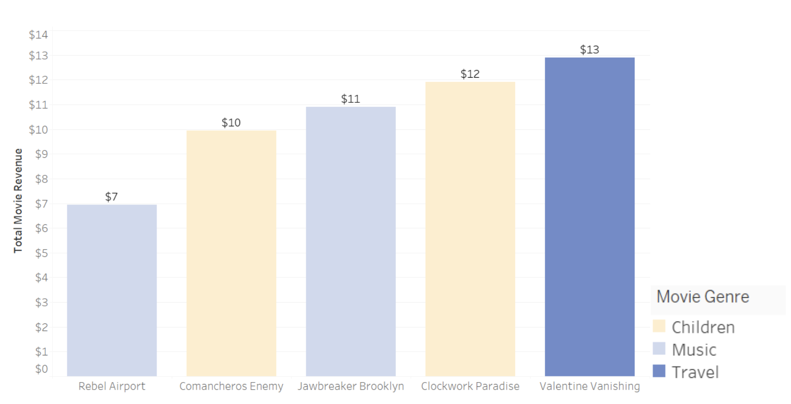

# Rockbuster Stealth: Turning Video Rental Data into Online Streaming Success

### [Github Repository](https://github.com/kirstencurrie/cf_rockbuster)

 

## Intro

Rockbuster Stealth is a video rental company (fictional) that would like to enter into the online streaming arena. SQL was used to join data, perform exploratory data analysis, descriptive statistics, and groupings with Rockbuster’s wide array of tables containing customer details, store locations, and movie sales. A dictionary and ERD (exploratory relationship diagram) were created and used as a continual reference when gathering insights from the data.

***Fig. A*** *Entity Relationship diagram of the Rockbuster Stealth data tables which includes data like Rental duration, Customers, Movie Titles, Employees, Store Information, etc. It's a Snowflake schema with multiple sub-dimensions present.*

 

***Fig. B*** *A comprehensive data dictionary was created in order to more easily map data tables and understand data keys and abbreviations used within the SQL code.*

 

## Key Business Questions

2023 Digital video rentals was a $4.3 billion dollar market value in the United States alone ([stat](https://www.statista.com/statistics/690368/movie-rental-revenue/)) To stay relevant with market demands, Rockbuster Stealth will curate a number of its licensed movie titles for online digital rental. The following business questions will target which movies and geographical markets to approach first.

- What was the average rental duration for all videos? 
- Which movies contributed the most/least to revenue gain? 
- Which countries are Rockbuster customers based in? 
- Do sales figures vary between geographic regions? 
- Where are customers with a high lifetime value based?

 

## Initial Movie Rental Statistics

Movies are typically rented for 6 days at a time, but can range from 3-7 days.

The average rental price is $2.98/movie but can range between $0.99 – 4.99.

***Fig. C*** *Frequency of movie rental duration is most frequent at 6 days*

 

## Movie Performance by Genre

Rockbuster’s performance by movie genre shows highest grossing revenue in Sports films to the lowest in Music related films.

***Fig. D*** *Movie genre performance at a global level*

 

Top ranking genres include Sports, Sci-Fi, and Animation. These titles represent the most rented movies within those genres.

***Fig. E*** *Saturday Lambs coming in first with a strong $191...*

 

The lowest ranking genres are Children, Music, & Travel--these are the lowest ranked films within those categories.

***Fig. F*** *Rebel Airport has not had much success with viewers*

 

## Target Countries & Regional Performance

India, China, and the United States represent the countries with the most customers and highest gross payments.

[Interactive Tableau Map](https://public.tableau.com/app/profile/kirsten.currie/viz/RockbusterCustomerPaymentTotalsbyCountry/CustomerPayments?publish=yes)

***Fig. G*** *India collectively has the most customers and highest number of rental payments*

 

Genre preferences fluctuate by country. Sports is a winner for India & the United States, but Animation takes the lead for China.

***Fig. H*** *Sports films represents an important category for top selling regions. Interesting to see Foreign films follow closely in second place for movie rentals in India.*

 

These customers represent the Ideal Demographic as they are the top paying customers within the top performing cities & countries.

***Fig. I*** *These customers need to be rewarded!*

 

## Conclusions & Final Recommendations

A variety of visuals were leveraged to help Rockbuster gain a clear understanding of where the majority of their business was deriving its sales from and how they might best accommodate those top selling regions. Other useful information was pulled from the SQL joins such as top ten customers from the top ten cities within the top ten performing countries. In order to help the company’s chief stakeholders make strategic decisions for their company, clear and concise points were made regarding their next steps and plan of action.

***Fig. J*** *Concise recommendations are provided to Rockbuster to help them prepare for launching into the online streaming business.*

 

---

### [See Next Project](project4.md)
