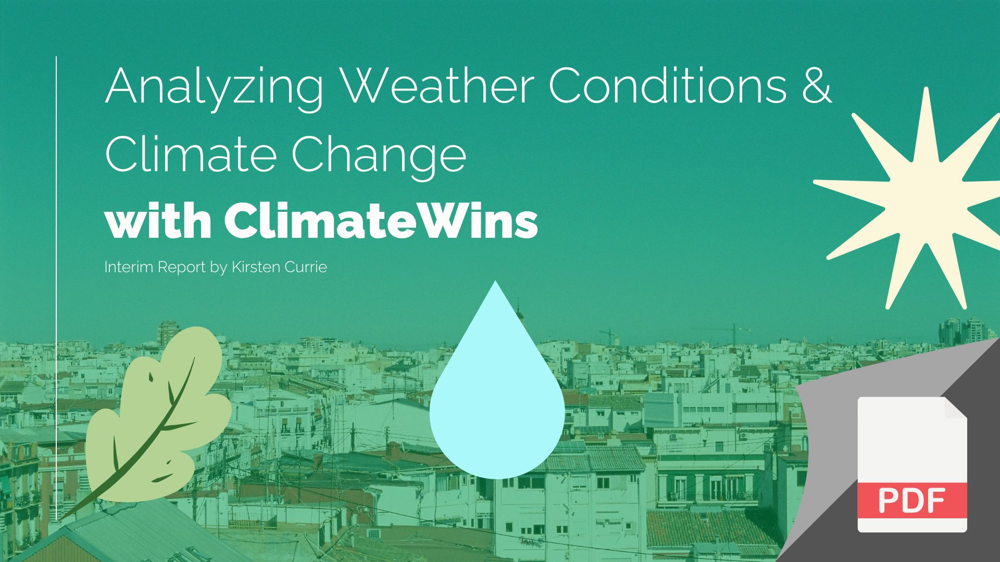

# ClimateWins: Shaping the Future of Climate Change response using Machine Learning

### [Github Repository](https://github.com/kirstencurrie/climatewins)

 

## Intro

This project was an intro into both supervised and unsupervised machine learning methods by analyzing publicly available European weather station data. The directive was to find the most critical measurements (e.g. minimum or maximum temperature, wind speed, sunny days, etc) a weather station might need in order to predict weather behavior.

The client--a fictional non-profit called ClimateWins--must know which method is going to provide the most informative results within scope of a budget and time constraints (e.g. can't spend too long training models and improving accuracy scores).

The code and data source can be viewed on the Github repository provided above.

The format of this report is provided into project reports as follows.

 

## Supervised Learning & Interim Report

 

## Unsupervised Learning & Final Report

 

---

### [See Next Project](project1.md)
