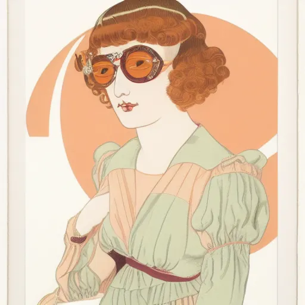
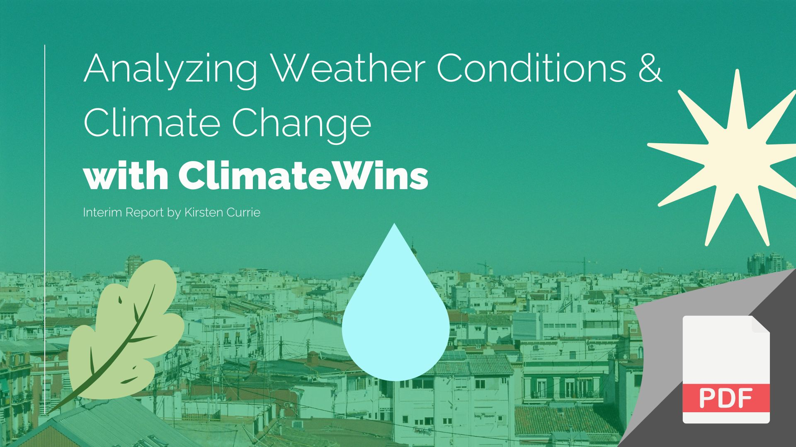

# How to Train Stable Diffusion to Sketch in Your Style

 

## Intro

In recent months, the internet has witnessed an explosive playground full AI-generated art experimentations. My trials included.

As we tinker with just the right natural language expressions to get our astronaut playing golf on the moon or try to recreate House of Dragon’s Princess Rhaenyra in MidJourney style, it seems that even our imaginations are unable to limit the delightful array of visual intoxication that keeps us hitting “generate”.

My personal interest stems from the desire to more quickly produce designs — specifically related to clothing. Many times I have found myself staring blankly at my new tablet sketch page trying to make the leap from getting what’s in my mind’s eye to materialize in sketch form.

It begged the question, how might we work with AI to generate work in a style matching our own?

 

I’d played around a bit with Open.Ai’s DallE but still found that more for sensational art rather than for iterative creation, so I decided to take a stab at using Stable Diffusion. You can quickly generate imagery using their online tool DreamStudio, but if you want more control over the art, you should install it onto your computer.

For the brevity of this article, I won’t be going into the exact steps I took for installing and running the program, but you can reference the step-by-step tutorial that I followed here. Stable Diffusion updates quite frequently, so some of the steps may have changed by the time you watch this.

 

## Image-to-Image Function

Once you’ve installed the program, there are quite a few different features you can mess around with.

I first started by exploring the img2img interface where you can upload a picture and add text with this image to help guide the model in creating new images, or, alternatively, ask the tool to analyze your image and generate text based on what it sees & understands (very fun to see how it interprets your art…).

For funsies, I first uploaded a personal sketch and then asked it to generate images in a style of art by George Barbier, an early 20th-century illustrator in Art Deco / Nouveau style.

For reference, here is an original George Barbier illustration:

And here’s my sketch (left) with Stable Diffusion generated images in George Barbier style (4 images on right):

As you can see the images definitely captured both the idea of the woman wearing sunglasses and a peach-colored tulle dress — and George Barbier’s soft yet flamboyant aesthetic.

 

## Training Models on Personal Drawing Style

I assume because there’s quite a bit of George Barbier work online and in the public domain, it’s likely easier for Stable Diffusion’s existing algorithm to understand what this might translate to from text to image, but if I were to ask it point blank to render an image in “Kirsten Currie” style, my results would likely be questionable.

Luckily there’s a way to train a model to understand a specific style and I did so by using DreamBooth. The specific method for doing so can be found here by the same Vlogger (Entrepreneur) I referenced earlier. If GitHub, Python, RunPod, or Hugging Face sound foreign to you, you might be in for a bit of a learning curve (as was I). There are different ways to train a model, but I used this method because the results seemed the most accurate.

Again, not going to get into the weeds in this article, but the steps I took were roughly as follows.

 

## Train Model with Existing Style of Sketches

The image here is a screenshot of the interface for Joe Penna’s Dreambooth-Stable-Diffusion repository on Jupyter Notebook. It walks you through a series of steps to fine-tune a model based on images you upload.

I input 12–15 of my sketches like the above to train the model on my style. They recommend anywhere from 10–30. Initially, I had tried around 50 but it really slowed things down and sort of crashed on me (but that was most likely solely user error…).

When you create your model, you also give it a unique name and token that you can reference when creating a text prompt in Stable Diffusion. Here I used “ksketch” and “style” as a way to signify my personal sketch style as a reference.

 

## Input Model in Stable Diffusion & Set Test Prompt

With my model created and downloaded, I relaunched Stable Diffusion and saved my model within the platform’s Settings — this enable me to then run AI generation based on the style of my personal sketches.

Because I wanted to test out the different sample methods and sampling sets, I came up with a text prompt to use multiple times in order to evaluate what was working/not working throughout my iterations:

Yes, that’s right — glittery pale purple demi cup bra and thong. Sorry, not sorry.

Anyhow as you can see, my token (ksketch) and style were input at the end of the expression. Placing a phrase in parentheses is supposed to help create more of an emphasis on that token when generating the image.

As of writing this article, there are 13 different sampling methods that Stable Diffusion allows you to use for image generation. I am not 100% sure how each of them works, but for this trial, I experimented with each one at different sampling steps— 20 and 50 steps respectively (you can go as high as 150 or as low as 1; their standard setting is 20 steps). Some methods tended to look either more or less detailed and/or “real life” than others.

 

## Fine-Tuning Sampling to Match Personal Sketch Aesthetic

While some of the sketches were unique and inspiring, the goal of this exercise was to see if I could get Stable Diffusion to generate sketch-like images that looked as if I had created them myself.

This meant I needed to comb through the different sampling methods to determine which would get as close as possible to my original style.

Please note that there are probably more ways to fine-tune than what was done in this exercise. I continued to use the same trained model, for example, but in theory, I could have trained a different model using more/other sketches for potentially better results. For now, I just wanted to see how accurate I could get by using existing tools within Stable Diffusion on the images already trained.

The first thing I noted was that it did render the images in flat sketch form — no person wearing the clothes. This was the first minor success as my original sketches were all flats.

In the above, I starred the sketches I felt could look the closest to my style. The DPM2 Karras (20 steps) and DDIM (50 steps) felt potentially the closest to mine. I really liked the output of the LMS Karras but had to admit that they still differed a little from my original look.

After this, I decided to add more emphasis to my token by including an extra set of parentheses:

Press enter or click to view image in full size

On this next round, I felt that the DPM2 Karras (50 steps) was starting to feel a lot more similar to my original sketches. You can see some of the same patterns and strokes that I might have used. I will show more of a before and after comparison later.

I then decided to bump up the emphasis once more with the third set of parentheses:

Suddenly I felt as if the tool was over-extrapolating. The DDIM was adding texture in the background of the 20 steps and adding the form of a person in 50 steps. DPM2 Karras completely dropped the underwear in 50 steps. Maybe the extra token emphasis wasn’t necessary.

Finally, I decided to drop all parentheses and test:

Although quite nice, I don’t think this round truly replicated my personal style, except for maybe DPM2 Karras.

 

## Comparison of AI-Generated to Human-Generated Sketches

When comparing alongside each other, are you able to discern which is AI generated and which is human? If you look closely, you can probably distinguish that one thing is not like the other, but they ultimately aren’t so far apart.

The AI sketch is second from the left.

 

## Final Thoughts

As designers and artists, it can often be intimidating to think about the power of AI and the potential threat it brings to our line of work.

However, I personally feel like AI — similar to other tools such as photoshop — is merely a tool that we can use to expand upon and speed up our work. Imagine instead of spending two full days pumping out 50 sketches (coming from personal experience…) spending only 10 minutes in AI generation software?

Although I’m against suggesting the AI output be used for a representation of our final work, I believe that it can inform and help craft the “meat” of our work that ultimately leads to the final cut we produce.

For example, I love to design lingerie, but sometimes I struggle to put pen to paper for the exact details I’m seeking. When I see some of the AI-generated examples, I most likely don’t vibe with the exact generation in its entirety, but more like bits and pieces that I can then reassemble and collate for a final piece that I create.

---

### [See Next Project](project1.md)
